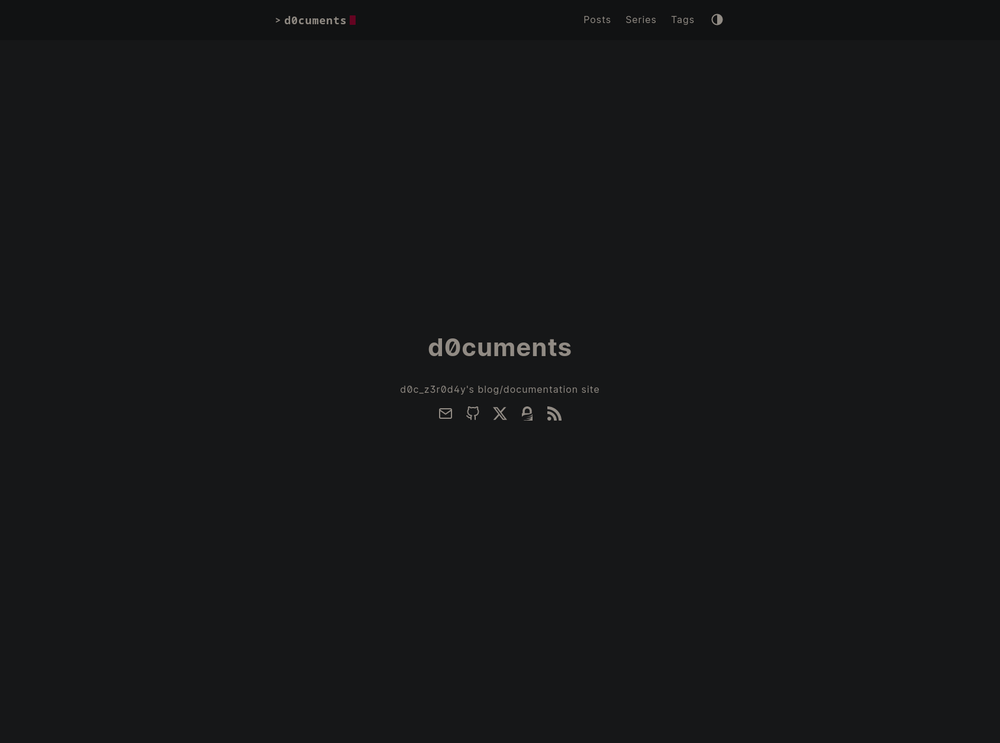
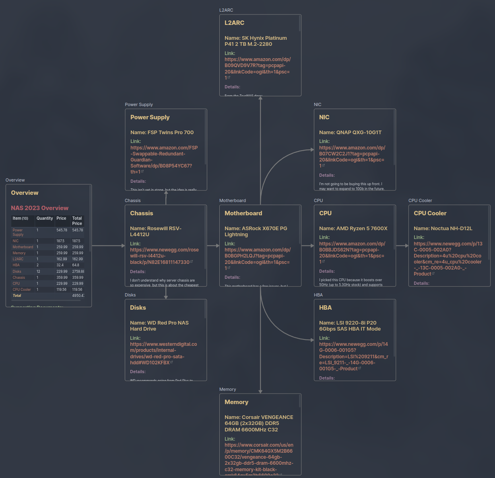
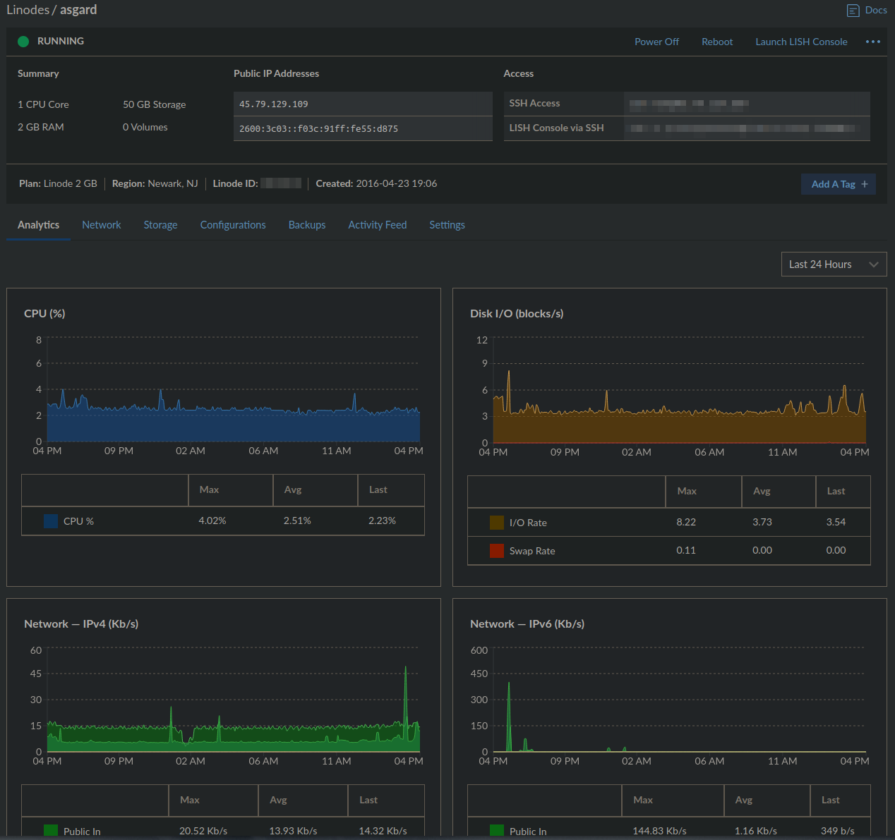
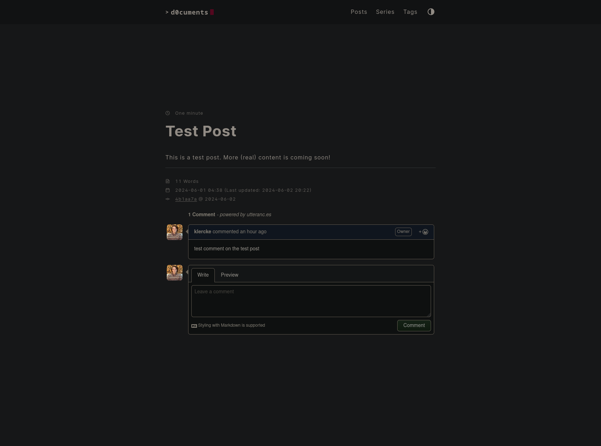

## Part z3r0: Background

I am terrible at writing things down.
I couldn't tell you the number of times I started working on project only to shelve it for a few months and be totally lost when I get back to it.
As my homelab has grown in complexity, peaking at over 30 virtual servers, this has become a huge hurdle for managing my network. 
While I have been paring down the number of servers I'm running lately, I have rediscovered a few different methods I've used to try to document my projects in the past.

### My Past Attempts at Documentation



I had an old [MediaWiki](https://www.mediawiki.org/wiki/MediaWiki) server running with a single (now decommissioned) server documented in it (ironically, the MediaWiki server itself was *not* documented).
My "homelab" [Obsidian](https://obsidian.md/) vault has excruciatingly detailed plans for a server that I have not yet built, but exactly 0 documentation of servers that actually existed at any point.
I've also looked at [NetBox](https://netboxlabs.com/) and [Hudu](https://hudu.com/).
While I definitely want to check out NetBox in the future, it isn't the right tool to solve this problem.
I've used very similar software to Hudu at work, but I usually find myself ignoring the information stored within it and going straight to the source for answers.
This prompted me to think about *why* I could never stick with documenting my network and projects.

While trying to answer this question, I noticed that is is not exclusive to me. 
At work, I sometimes find myself complaining about lacking documentation for servers built by others, but often forget to document servers that I build.
More often than not, before I check our documentation for information on a server, I will just remote into the server itself and try to gather the information myself.
After analyzing my thoughts each time I find myself doing this, I have identified a few reasons behind it:

### Why Documentation Fails

1. **The documentation is untrustworthy.**

    I'm sure that my coworkers are (mostly) entering correct information when they create new documentation, but much of this information can change over the lifetime of a server.
    Most of our customers do not have strict IT policies, so the IP of a server can change (hopefully on purpose and not because it had a DHCP address), additional roles/applications can be installed, the server can be physically moved or migrated to a new host, etc.
    This raises a few questions for me; namely, "is there a better way to document this?" and "should we even be documenting this?".

    To answer the first question: almost certainly.
    Information such as hostnames, IP addresses, OS versions, and even installed packages and roles can be automatically collected fairly easily.
    Any credentials will be stored in a password manager or secret server of some sort.
    In a strong [Infrastructure as Code](https://blog.z3r0d4y.dev/tags/iac) environment, much of this information is "self-documenting" and can easily be found in the code written to create the infrastructure.
    Barring that, it takes under a minute to manually check this information if you have access to the server (though it is helpful to be able to access it if the server is offline).
    The second questions leads me into my second reason why I believe these documentation systems have not worked for me.

2. **We are documenting the wrong information.**

    To design a better system for documentation, it's important to think of the reason the documentation system exists needs to exist in the first place.
    As already mentioned, documenting IP addresses and installed applications isn't the problem I'm trying to solve.
    So what is?
    The thing I find myself asking most often when I'm searching through documentation is "what the hell was the guy who deployed this thinking?!"
    Even with servers/services I deployed myself, the problem I struggle with the most is getting into the mindset that I was in when I deployed it.
    Remembering why I made certain decisions helps me remember other decisions I made.

3. **The documentation doesn't exist.**

    The final point in this vicious cycle of un-documentation is that oftentimes, documentation never exists in the first place.
    I believe this is partially due to simple forgetfulness.
    At work, writing documentation is part of our project plans but can often get overlooked due to the many other "more important" tasks that need to be completed.
    In my home network, writing documentation is hardly on the top of my priority list.
    I want to deploy this cool new service and start playing with it immediately (or go do something entirely different).
    Rarely does the thought of documentation ever cross my mind.
    I also believe my previous points contribute to this point, and this point contributes to the others.
    We don't think to update the documentation because we don't use the documentation and we don't use the documentation because we don't think to update it.

### Why a Blog

So what does this have to do with a blog?
For my (personal) purposes, a blog fixes these issues.
My blog isn't going to document things like private IPs of servers, but rather my methodology for deploying services and my thought process behind each project.
I'm also more motivated to write documentation in the form of a blog post than I am a wiki entry since blog posts can be "enjoyed" by others.
I'm a firm believer that **information should be free**, so I want to share my thoughts with anyone who cares to read them.

Side note: Since I mentioned work quite a bit in my reasoning above, I should clarify that I do not think companies should abandon their current documentation in favor of blogs.
Proper documentation is always going to be much faster to scan for information that a blog post that has a story to tell.
I have heard of companies that have internal developer blogs *in addition* to documentation platforms and my understanding is that they are usually received quite well.
I think this is one way that corporate environments differ from homelabs.

## Part 0n3: Infrastructure

With that little manifesto out of the way, let's get into the technical aspects of my blog, starting with the infrastructure that it runs on.

### The Server



Despite having a collection of perfectly good servers running at home, I decided to deploy my blog to one of my [Linodes](https://www.linode.com/lp/refer/?r=fca3e57ade14bb3371ad530f882e3283e18bd68b).
Please note that this is link is my personal referral link.
Signing up for Linode with this link will give you a $100 credit that is good for 60 days and will give me a $25 credit.
More information can be found [here](https://www.linode.com/referral-program/).

Since a statically rendered blog is a relatively lightweight application, I don't need the horsepower of my on-prem servers to run it.
Hosting in a VPS also allows me to have high uptime for my blog without having to worry about making my site unavailable during a power outage or server maintenance.
Of course, on-prem servers do also carry security implications, so not having my blog potentially expose any part of my home network to attack is a plus as well.
Currently, the blog is running on my long-time Linode named "asgard", which is running Arch Linux (btw) and hosts a few other web services that my friends and I use.

As a quick sidebar on asgard, it has gone through a few iterations since I first purchased it back in 2016.
I originally set it up based on the [Level1Linux "Your Linux Server" Series](https://www.youtube.com/watch?v=SlEQ6GGIyBc).
Watching this video 8 years ago is probably one of the most important things to happen to me as I don't think I would be in the IT field today without it.
The server has been wiped a few times since then, but it still serves as somewhat of a time capsule for me.
A lot of things on that server are not configured the way I would do them today.
While I have swapped out some packages and hardened the server as time has gone on, I do think it's about time to rebuild asgard once again.
I have some exciting ideas for this next iteration, which will almost certainly be the subject of a future blog post.

To quickly touch on DNS, I use [Njalla](https://njal.la/) as my DNS registrar for pretty much everything.
Obviously, I am not using it to remain "anonymous", but I appreciate their commitments to privacy and don't mind paying a little extra to support them.
Also, I highly recommend checking out [their blog](https://njal.la/blog/).

### The Software

#### GitHub
The source files for the blog are all hosted on [GitHub](https://github.com/klercke/blog.z3r0d4y.dev).
When I push a commit, GitHub Actions renders the Markdown files that I wrote into HTML and pushes them to asgard (more on that later), where they are visible to anyone on the internet.
Each blog post has a comment section provided by [Utterances](https://utteranc.es/).
Each new post gets a GitHub issue created automatically and comments on those issues are shown as comments on the post (more on this later as well).

#### Hugo

The blog is built using [Hugo](https://gohugo.io/).
I tried a few different static site generators, but I was extremely picky.
I knew I wanted my source files to be written in Markdown, I wanted to have strong control of the site's appearance, and I wanted at least some control over the organization my source files.
I was also 100% set on using a site generator that would allow me to check the site into Git in a way that makes it easy to browse without rendering.
Of course, it should go without saying, but I was only going to use a site generator if it was open source.
This led me to try two static site generators: Jekyll, which I had used once for a past project, and Hugo.

Ultimately, I settled on Hugo due to it being slightly easier to use (in my opinion) and incredibly fast.
At the time of writing, the entire site builds in 50-100ms on my mid-tier desktop.
The entire deployment process from my commit hitting GitHub to the content being visible on the site takes about 5 seconds.

For my Hugo theme, I'm using [hello-friend-ng](https://github.com/rhazdon/hugo-theme-hello-friend-ng).
I have made one [extremely minor tweak](https://github.com/rhazdon/hugo-theme-hello-friend-ng/compare/master...klercke:hugo-theme-hello-friend-ng:master) in order to get the RSS icon to appear on my homepage, but I plan on customizing the theme more in the future.
I tried at least a dozen themes and hello-friend-ng was by far my favorite.
I initially planned to use [Gokarna](https://github.com/526avijitgupta/gokarna), but found that I slightly preferred hello-friend-ng after playing around with the plugins and features of each. 

#### Caddy

Once the blog is rendered, it is served to users by [Caddy](https://caddyserver.com/).
I have used Apache as a web server and Nginx (which is totally pronounced "EN-jinx", not "EN-gin-ex", by the way) as a reverse proxy for years, but swapped to Caddy this year.
Caddy has made everything so much simpler to host.
The entire configuration for this site is only a few lines:

```JSON
blog.z3r0d4y.dev {
    root * /srv/http/blog.z3r0d4y.dev/public
    file_server

    @plausible path /js/script.js /api/event
    handle @plausible {
        rewrite /js/script.js /js/script.js
        reverse_proxy https://plausible.io {
            header_up Host {http.reverse_proxy.upstream.hostport}
        }
    }	
}
```

The majority of this block is actually for proxying Plausible, my analytics tool (another "more on this later" item), through my own domain.
If I didn't want to take this step, the configuration would extremely simple:

```JSON
blog.z3r0d4y.dev {
    root * /srv/http/blog.z3r0d4y.dev/public
    file_server
}
```

Caddy handles redirecting HTTP traffic to HTTPS automatically and even automatically generates Let's Encrypt TLS certificates, which is a huge time saver.
Caddy is an incredible piece of software that I cannot recommend enough.

## Part 7w0: Features and Plugins

### Commit Links


As part of my "[radical transparency](https://www.process.st/radical-transparency/)" mission with my blog, I want it to be obvious to users that the site is a Git repository that can be cloned and modified if desired.
To accomplish this, I'm using hello-friend-ng's built-in commit linking feature.
In the [params] section of my hugo.toml, I specified the link to my GitHub repo and Hugo takes care of the rest.
As soon as a page is committed, a link to the commit that modified it will be added to the bottom.
Since the blog is deployed to the server by GitHub actions, each page will necessarily have a commit associated with it.

### Comments



One of the benefits of my whole blog being stored in a GitHub repo is that we can use GitHub issues as a commenting system.
Since one of my goals for the blog was for it to be fully browsable without visiting the site itself, all of the site content can be viewed in the GitHub repo, so it only makes sense for the comments to be on GitHub as well.
I wish that the comments were more "portable" so that they were stored in the repo itself and could be read offline, but I can live without this due to the simplicity that GitHub issues and Utterances offer.
Hello-friend-ng has native support for Utterances, so I just had to add the Utterances bot to my GitHub repo and add a few lines to the [params] section of my hugo.toml:
```TOML
  # Utteranc.es (comments)
  [params.utterances]
    # Comments repo
    repository = "klercke/blog.z3r0d4y.dev"
    
    # Comments issue label
    label      = "Comment"

    #   Blog Post <-> Issue mapping. This parameter is optional. Possible values are:
    #      - pathname
    #      - url
    #      - title
    #      - og:title
    #      - issue number
    #      - specific term
    issueTerm  = "og:title"

    #   Theme used: possible values are:
    #      - github-light
    #      - github-dark
    #      - preferred-color-scheme
    #      - github-dark-orange
    #      - icy-dark
    #      - dark-blue
    #      - photon-dark
    #      - boxy-light
    #      - gruvbox-dark
    #
    theme      = "preferred-color-scheme"
```

Users can comment directly on the post by signing in with GitHub or they can comment directly on the issue on github.com.

### Analytics


Of all the decisions I made regarding this blog, this was by far the most difficult.
I hate tracking and spyware as much as the next guy (and probably far more), so I was initially very against any sort of analytics on my site.
I don't want to contribute to the surveillance economy, but I do want the basic information that will allow me to track how well my blog is performing and ideally write better content.
Hello-friend-ng has support for [Plausible Analytics](https://plausible.io/) built in, so I tried it out when I started building this blog in March.
After my trial expired, I decided that I felt "dirty" using any sort of analytics platform, and removed Plausible from my site.
After more deliberation over the past three months, though, I decided that the data I get from an analytics platform, even a basic one, will be necessary for achieving my long-term goals with this blog and keeping myself motivated to keep posting.
Since the theme has Plausible support built in, I decided to look deeper into Plausible's offering.
It was trivially easy to add Plausible to my site once my account was configured:

```TOML
  # Plausible.io analytics
  plausibleDataDomain = 'blog.z3r0d4y.dev'
  plausibleScriptSource = 'https://blog.z3r0d4y.dev/js/script.js'
```

After demoing Plausible again, I have decided to add it back to my site for the time being.
It's open source, lightweight (the script that gets loaded when you visit the blog is under 1KB), and self-hostable.
They claim to have no investors and not sell any user data.
Their [data policy](https://plausible.io/data-policy) specifies exactly what they collect, which is not much.
I can't even view the IP address of users who visit my site.
I am currently using their SaaS offering, but I do have plans to move to their self-hosted "community edition" once I move the blog to its own Linode.

Many adblockers, including uBlock Origin, which I use, do block Plausible by default, so I have proxied Plausible's analytics script through my own server as seen in my Caddy configuration above, hiding its true URL from most adblockers.
**If you wish to block or opt-out of analytics on my site, please add "https://blog.z3r0d4y.dev/js/script.js" to your adblocker's blocklist.**

For now, in the interest of transparency, I have made my [Plausible dashboard](https://plausible.io/blog.z3r0d4y.dev/) publicly available.
Once I move to Plausible CE, I will likely have the dashboard embedded on this site.
Currently, uBlock Origin blocks the embed from Plausible's site (understandably).

I am open to feedback regarding analytics.
If you have any opinions you would like to share, please do reach out (perhaps using the comment section on this page :)).

## Part 7hr33: Workflows

### Writing

")

I am very particular about my workspace when I am writing (whether it be prose or code), so having my particular flavor of writing workflow was one of my end goals with my blogging setup.
As you can see in the screenshot above, I write my blog posts in Neovim on my Linux desktop ([EndeavourOS](https://endeavouros.com/), specifically).
My [Neovim config](https://github.com/klercke/nvim) is set up to be multipurpose, but I do have a few customizations for writing Markdown files.
One of the most important customizations is the "Date" command I added.
Hugo will generate the timestamp for a file when it is created, but since I spend days or weeks (or months) writing posts, this timestamp is not accurate to the actual publication time.
When I am done with a post, I can clear out the "date" field in the frontmatter and run the Date command in Neovim, which will populate the current date.

The window on the bottom left is a terminal running the "hugo serve -D" command, which is an incredible feature of Hugo.
It starts a local web server and compiles the entire site (including drafts due to the -D flag), making it available at localhost:1313.
While running, hugo serve will also watch for changes to any files in the site and automatically re-compile them and refresh the page.
This means that whenever I save my source file in my Vim window (*Vimdow*, if you will), the changes are immediately reflected in the Firefox preview on the right half of my screen.
Since Hugo can compile a page in a few milliseconds, this preview updates basically as soon as I save the source file, making it easy to see what the post is going to look like.

On the right half of the screen, I have Firefox.
Since I have an ultrawide monitor, splitting it in half still gives me plenty of room for a comfortable size editor alongside a browser taking up half the screen.
Most of the time while I'm writing, I have Firefox open to the preview version of the post I'm working on.
I usually also have a few other tabs open: the GitHub repo for this blog so I can monitor the status of the GitHub Actions workflow that builds and deploys the site (I promise we're getting there), the production version of the site to make sure the new posts show up right, and Plausible because I keep checking the dashboard to see if anyone has visited my blog that still has no posts.
I also use Firefox for quick research while writing.
For example, quickly fact checking something or getting a link for a topic that might be lesser-known or need further clarification so that I can link it in the article.

Occasionally, I will also need to open a terminal to reference a file or SSH into a server.
In this case, I will usually go to another i3 workspace that has a terminal open or quickly open a terminal on the bottom right of the screen and close it when I'm done.

### File Management and Text Organization

Each post lives in a folder named in the format "YYYY-MM-DD-post-title".
The date is the post's publication date in [ISO 8601](https://www.iso.org/iso-8601-date-and-time-format.html) format (objectively the best format for computing) so that sorting the posts alphabetically will sort them by publication date.
Inside each post folder is a file called "index.md", which is the actual text content of the post before it is rendered into HTML.

Each post's folder also includes all images used in that post.
The images are named numerically, starting with 001.png as the first image and incrementing as you continue further down the post.
I try to rename the images to be in the same order as they appear, but I may mislabel a few as I move content around in the post.

Within the source files themselves, I try to keep my formatting consistent for ease of reading.
I put a newline before and after each header, code block, or image and try to put descriptive alt text and a caption on each image.
If the image caption is already sufficiently descriptive, I may omit alt text as a screen reader will also read the caption.
Each sentence goes on its own line.
This is a holdover from my days of writing hundreds of lines of LaTeX every day, but comes in extremely handy when writing in (Neo)vim, since any operation on a line is an operation a sentence.
For example, "dd" normally cuts a line, but in my case, it will cut an entire sentence, which makes re-arranging content lightning-fast.
Unless I need to use Firefox for quick research, I can write and publish an entire article without ever touching my mouse.

Since each post is wholly contained in a post folder and each post folder contains exactly one post, I can commit individual posts with "git add ./content/posts/[post folder]" and avoid committing any unfinished posts to GitHub (though even if I did, unfinished posts are marked as drafts so they still wouldn't show up on the production website).
If you'd like to check any of this out, please do visit the blog's repo on GitHub and poke around in the file structure.

### Deployment

**This is one of my favorite parts of my blogging setup.**
Since the entire blog is stored in a Git repo and can be built with a single command, it is easy to automatically publish articles without ever having to touch the server that is hosting the blog.

When I finish an article, I just have to unmark it as a draft by removing "draft: true" from the frontmatter, commit the article folder, and then push the commit to GitHub.
Once the commit hits GitHub, GitHub Actions takes over and clones the repo, builds the site, and then uses rsync to sync the new (or updated) files to the production server.
From my perspective, pushing to GitHub is pushing to blog.z3r0d4y.dev.
I am somewhat familiar with Azure DevOps and GitLab, but I had never used GitHub Actions before, so my workflow is based on [Scott W Harden's excellent article](https://swharden.com/blog/2022-03-20-github-actions-hugo/).
I made some tweaks to his configuration in order to support all of the features of my site and to clear warnings about outdated Actions that were generated by checkoutv3, but the majority of the configuration is based on his.
At the time of writing, my workflow looks like this, but the live version can always be found [here](https://github.com/klercke/blog.z3r0d4y.dev/blob/main/.github/workflows/blog.yml):

```YAML
# Based on https://swharden.com/blog/2022-03-20-github-actions-hugo/
name: Build & Push to Site

on:
  workflow_dispatch:
  push:
    branches:
      - main

jobs:
  deploy:
    name: Build and Deploy
    runs-on: ubuntu-latest
    steps:
      - name: 🛒 Checkout
        uses: actions/checkout@v4
        with:
          submodules: 'recursive'
      - name: ✨ Setup Hugo
        env:
          HUGO_VERSION: 0.126.2
        run: |
          mkdir ~/hugo
          cd ~/hugo
          curl -L "https://github.com/gohugoio/hugo/releases/download/v${HUGO_VERSION}/hugo_extended_${HUGO_VERSION}_Linux-64bit.tar.gz" --output hugo.tar.gz
          tar -xvzf hugo.tar.gz
          sudo mv hugo /usr/local/bin 
      - name: 🛠️ Build
        run: hugo
      - name: 🔐 Create Key File
        run: install -m 600 -D /dev/null ~/.ssh/id_rsa
      - name: 🔑 Populate Key
        run: echo "${{ secrets.PRIVATE_SSH_KEY }}" > ~/.ssh/id_rsa
      - name: 🔐 Load Host Keys
        run: echo "${{ secrets.KNOWN_HOSTS }}" > ~/.ssh/known_hosts
      - name: 🚀 Upload
        run: rsync --archive --delete --stats -e 'ssh' public/ ${{ secrets.REMOTE_DEST }}:/srv/http/blog.z3r0d4y.dev/public
```

## Part f0ur: Conclusion

### Reflection

I am beyond excited to publish this article as my first blog post this evening.
I've been working on this blog on and off for the past three months and I have a number of posts that I am excited to publish in various states varying from "an idea" to "almost ready to publish", but I wanted to get the site to a state that I am happy with before publishing and publicizing anything.

I'll be writing more about this soon, but the idea of infrastructure as code, is extremely interesting to me and is a bit of a fixation of mine right now.
Not to spoil any upcoming content, but IaC is going to be a big focus of at least one series that I have in the works.
I am extremely satisfied with how well IaC concepts were able to be applied to my blog.
Since all of the content of the blog is stored in a repository that anyone can clone, it would be extremely difficult for me to lose this content; it's all backed up on GitHub.
If I somehow lost my Linode and my desktop at the same time, I would be able to clone the Git repo on any machine and run a local copy of my blog or even share it out to the internet with a quick DNS change.

The editing workflow is also perfect for me, being quite satisfying.
I am usually pretty terrible at keeping with habits, especially time-intensive ones.
Since this blog post alone has taken me the better part of this weekend to write, it's important for me to enjoy the writing process to stay motivated.
Just as a nice pen and notebook keep me motivated to practice writing by hand, I am already looking forward to finishing and publishing my next post.

### Feedback

One thing that was drilled into me as a scout is the phrase "feedback is a gift" (it truly is).
I welcome any (constructive) feedback, positive or negative on this blog.
Feel free to use to the Utterances comments below or reach out to me directly using any of the contact methods on [my homepage](https://blog.z3r0d4y.dev/).
While this platform is primarily meant to be documentation for myself, almost like a journal, I do also want it to be entertaining and/or helpful for others.
My goal while writing this article was not to make a tutorial, but to explain my mindset and reasoning as I built the blog while maintaining important technical details.
I'd really like to know if you think there's anything I missed or, more likely, details that I shouldn't have included.

More posts coming soon :)

