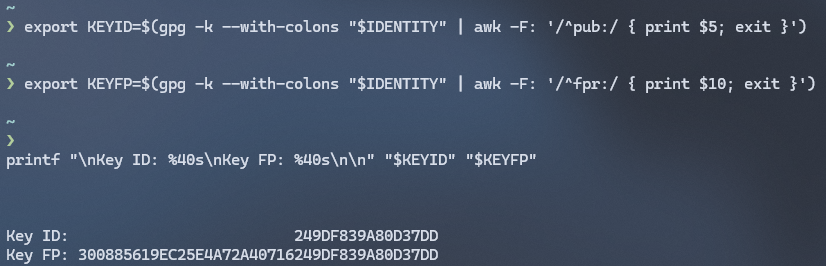
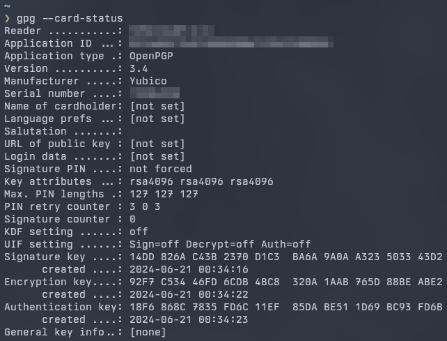
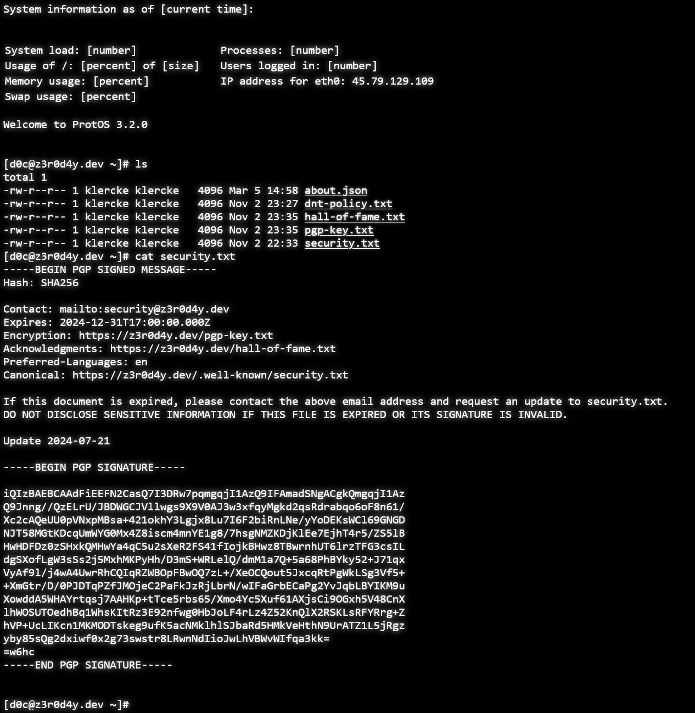

*Note: This post took me nearly two months to complete. 
On two separate occasions while working on this, I updated the Windows partition on my PC.
On both occasions, the Windows update broke my Linux partition.
I have not yet been able to recover from the second of these incidents and I am in the middle of migrating to NixOS anyway.
In the interest of finally getting this blog post out, I have opted to finish writing this post in WSL2 on my Windows machine.*

## Part z3r0: Background

When you interact with someone on the internet, how do you know they are who they say they are?
Even if you can trust that someone is who they say they are, how do you know that there isn't some third party listening in on your conversation?
The answer to these questions is digital signatures and encryption.

While there are many applications offering ways to send an "encrypted" message to another user, many of these applications require users to trust encryption keys generated by the app.
Contrasting this, BYOK/BYOE (Bring Your Own Keys/Bring Your Own Encryption) is a cloud computing concept that can be summarized as letting users generate and use their own encryption keys.
While this typically the process of encrypting enterprise data on-prem and then uploading the encrypted data to a cloud provider, I think the BYOK model can (and should!) be successfully implemented by individuals in their daily lives.
Specifically, GPG keys are quite easy to introduce into your daily life (or just sensitive communications) if you are just a little bit technical and solve both the authentication and encryption problems.

Side note on the term "GPG Keys":
I use the terms "GPG" and "PGP" interchangeably.
If you want to know the difference, [this StackExchange thread](https://unix.stackexchange.com/questions/31996/how-are-the-gpg-usage-flags-defined-in-the-key-details-listing) has more detail than I can/care to cover.
While GPG and PGP are different, this post is specifically referring to keys generated by the GNU Privacy Guard tool, so I will usually refer to them as "GPG keys".

Another benefit of using GPG keys for "DIY" encryption is that a message encrypted with a GPG key is also implicitly signed by that key, meaning that a GPG-encrypted message can only be read by whomever holds the keys it is encrypted for (ideally, the message's intended recipients) and it can be trivially verified that the message was signed by a given key.
When I say "DIY" encryption, I am referring to the small-scale end-user approach to BYOK: manually encrypting a message through GPG and then sending the cyphertext block over whichever channel you choose.
I've done this for a number of years, from encrypting sensitive data before sending it to a friend of colleague, to automatically attaching my public key and a signed copy of every email I send to the original message, to more advanced (and less applicable for the average person) purposes, like [signing my site's security.txt](https://z3r0d4y.dev/.well-known/security.txt).

For most of these purposes, I have used my primary GPG key, which has been available on [my site](https://z3r0d4y.dev/pgp-key.txt) for as long as I can remember.
That key is set to never expire, but it's time to retire it for a few different reasons:

1. **I no longer have access to the private key.**
    I have not had access to the private key since this keypair was generated.
    I stored the private key on my YubiKey, which lets me use the key to perform GPG operations such as signing and encryption, but the private keyfile itself was put onto an encrypted flash drive, which I can no longer get into.
    I have known this was going to become a problem for a while, but it has become a bigger issue lately as I have more or less stopped using the primary email address attached to that keypair and have since started using a few emails which are not attached to the keypair.
    Since I can't edit the key anymore, I have no way to make these changes.

2. **My YubiKey is starting to die.**
    I'm not at all surprised that this is happening.
    I've had this YubiKey for 4 or 5 years now, carrying it in my pocket every day.
    It's pretty surprising that it's held up this long, to be honest.
    Currently, it's in a state where I can connect it to one of my computers and read information such as the serial number, but I can only sometimes use the private key stored on it. 
    Combining this with reason #1 means that my private key is effectively lost (or will be soon).

3. **I want to go through the process of generating a new key.**
    I was still very new to the GPG ecosystem when I created my "primary" key a few years ago, and was also nowhere near as familiar as I am today with a many cybersecurity principals.
    While I don't think my private keys were ever exposed, I think there's a fun opportunity to generate my new keys under extra-hardened conditions so I can rest assured that my private key was not compromised.
    More importantly, I can earn the nerd credits of being able to say that my keys were generated on an air-gapped machine and would never touch a machine that had ever been or would ever be networked.

That all leads us to this post.
I've documented how I generated my new GPG keypair, what I'm using it for, and [most importantly](https://blog.z3r0d4y.dev/posts/2024-06-02-blog-setup/#why-documentation-fails), why I made the decisions that I made.

I'm basing my setup off of [drduh's excellent guide](https://github.com/drduh/YubiKey-Guide), which I would highly recommend reading.
I used this guide for generating my keys a few years ago and again for generating my new keys in this post.
The guide goes into great detail and explains many steps that I was struggling to find documentation for.

## Part 0n3: Key Generation Environment

The last time I went through this process, I disconnected my daily-use system from the network, went through the key generation process and then removed the private keys from my machine before reconnecting to the network.
While this is already more paranoid than I need to be, this sort of paranoia is fun, so let's take it a few steps further.

My first thought for a key generation environment was a Docker container that I would remove when I was done using it.
This would be simple to set up and I could even write scripts to automate much of the process, but that also means any malware on my system could theoretically also execute commands in the Docker container, stealing my keys.
Additionally, my understanding is that while files in a Docker container are not directly accessible by the host OS, they are still written to the disk in a way that could theoretically be read back by another actor.
Finally, I didn't want to mess around with having to pass in USB devices, both the YubiKeys and the flash drive that will hold my private keys, into a Docker container and wasn't sure how to do this securely anyway.
For all of these reasons, I decided to throw out the Docker container idea.

My second thought was to use one of my spare Raspberry Pis.
I would install an OS, maybe Arch ARM if I was feeling spicy, connect to the network to install the required packages, then disconnect from the network.
Once I was done with the system, I could just wipe the SD card (or even destroy it since they are so cheap).
This method is actually how the drduh guide suggests going about key generation.
The only thing that kept me from going through this process is that I honestly don't have anywhere to set up a keyboard, monitor, and mouse other than at my desk.
Since I wanted to retain use of my desktop PC, both for writing this post and so that I didn't have to go through the entire key setup process in one sitting, I decided to find another method.

Next, I decided I would boot into a [Tails](https://tails.net/) live environment on one of my laptops, a ThinkPad T530 for those curious, and generate the keys there.
I disconnected the SSD that normally lives in the laptop, booted into Tails, and enabled airplane mode (though, enabling airplane mode isn't necessary since I can simply just not connect to any wireless networks).
Since Tails already includes GPG, I was ready to start generating keys.
Luckily though, I got to that point and then decided to call it a night since it was getting late.
I say this was lucky because then next day, I decided to actually review the drduh guide for the first time since deciding to start this project.
I noticed the guide now includes instructions for building a NixOS live image that includes all the software necessary for following the setup guide.
This was *perfect*.
I had been meaning to give NixOS a try, but even with zero Nix experience, it was trivially easy to build the ISO.
Within a few minutes, I had my trusty ThiccPad booted into the NixOS environment, which even has an offline copy of the drduh guide right on the desktop.
All of the necessary software was pre-installed and all of the instructions in the "Prepare GnuPG" section of the guide were already completed.
I would definitely recommend using this NixOS image if you want an easy way to set up your key in an airgapped environment.

Unfortunately, the one security concession I had to make is that this ThinkPad is not [corebooted](https://www.coreboot.org/)/[Librebooted](https://libreboot.org/) (yet).
I considered trying to libreboot the laptop before going through this guide, but the lack of specific instructions for the T530 scared me.
I do think I will try to get my hands on a ThinkPad X220/X230 at some point, though, which I will libreboot and use as my "high security" machine.
I have some other fun ideas for the X220/X230 project, so there will definitely be a few posts about those if I do get my hands on one.


## Part 7w0: Defining Variables 

Before we can actually generate the keys, there's some info we need to know, decisions we need to make, and passphrases we need to generate.
I booted up my ephemeral NixOS system, confirmed that all of the "Prepare GnuPG" steps were already completed, and I was ready to rock.

### Identity

Since this is replacing my every-day personal key, I will use my real name and email for the identity:

```console
IDENTITY="Konnor Klercke <kⅼеrсkе@рrоtоոⅿаіⅼ.соⅿ>"
```

**NOTE: Anytime an email address appears in this post, it will obfuscated using [this tool](https://obfuscator.uo1.net/) to hopefully prevent bots from adding me to spam lists.
If you try to copy-paste these addresses to email me, I will not receive your message.**

I do also plan on creating a separate key for my "d0c" identity and my work identity, but I only have two spare YubiKeys at this point and will be using both to create two copies of my personal identity.
It's a good idea to keep your identities separated by role, much as you would want to keep your personal email separate from your work email or your standard domain account separate from your domain admin account.
Once a few more YubiKeys enter my budget, I will be following this exact same process to generate new keys for ⅾ0с@z3r0ⅾ4у.ⅾеⅴ and my work identity.

### Key

The drduh guide recommends a key type of rsa4096.
Admittedly, I am a novice when it comes to cryptography, but I thought I had my mind up about the type of key I was going to be generating.
Initially, I was planning on completely disregarding this advice and generating an ed25519 key instead due to the tiny size of these keys and the myriad backup options this gives me.
Unfortunately, however, a quick bit of research taught me why this was a bad idea:

Firstly, GPG does not have any sort of key negotiation system.
If I sign a PGP message with ed25519 key and your GPG agent doesn't support ed25519 keys, there's no way for it to "fall back" to an RSA key.
This means many people and systems would not be able to verify my signatures.
RSA is much more common and is supported by pretty much any system.

Second, it turns out plenty of services don't support ed25519 SSH keys yet, which is quite disappointing.
Notably, I tried to use my ed25519 public key for the admin account in a Linux VM in Azure recently and was met with an error that Azure does not yet support ed25519 keys.
I expect that this will become less of an issue in the future, but I need to be able to use my SSH key everywhere, or it sort of defeats the point.

Third, rsa4096 is the maximum key size supported by GnuPG.
Note that the [GnuPG FAQ](https://www.gnupg.org/faq/gnupg-faq.html#sec-11-4) does encourage the use of ECC keys (such as ed25519) rather than rsa3072 or rsa4096 if you need more security than rsa2048 offers, but for the reasons I already mentioned, this isn't really an option.
The large key size doesn't matter much to me since the public key will fit on my YubiKey regardless.
The computational overhead also doesn't matter much to me.
I've been using rsa4096 keys for years and I have never thought that operations took too long.
I'm using my keys a few times a day, not thousands of times per minute.

With all of that out of the way, I can define my key type, using the guide's recommended rsa4096:

```console
KEY_TYPE="rsa4096"
```

### Expiration

I have traditionally generated non-expiring keys but I have changed my mind on this.
I now believe that regular key rotations promote good key hygiene.
In my professional life, I generally make most keys last 1 year since there is usually an entire team of people that can keep up on key rotation reminders.
Since I will be using this key for myself, I chose to go with a roughly 2 year expiration time, which is conveniently also what the guide recommends.

I'm setting the key to expire on June 1st 2026, just under 2 years from when I actually generated it:

```console
EXPIRATION="2026-06-01"
```

I set multiple reminders in my calendar to renew my subkeys before they expire. 

### Passphrase

The guide provides a handy script to generate a 30-character random password, but it also recommends [Diceware](https://diceware.rempe.us/#eff) as another option for generating a passphrase.
Since each Diceware word is a 5-digit number, a 6-word Diceware phrase can be also be encoded in 30 characters, which are all numbers 1-6.
In my mind, Diceware provides additional security for a number of reasons:

1. Diceware can be generated 100% offline on actual dice.
The Diceware lookup site is a static HTML site which is included in the NixOS image I am using.
These facts combined mean that I can use a truly random analog random number generator to generate my "seed phrase", then convert that into an actual passphrase 100% offline.

2. Since my paper backups can be a stream of 30 digits, which then have to be converted into my actual passphrase, it is less likely that someone could find themselves in possession of my paper backups and gain access to my private key.
In my mind, this is better than directly writing my passphrase on a piece of paper.

3. It gives me another use for all of these damn D&D dice I bought.

Speaking of paper backups, the 30 character passphrase length is convenient because the guide provides a [handy template](https://raw.githubusercontent.com/drduh/YubiKey-Guide/master/passphrase.html) which can be printed out for making paper backups of your passphrase.


This makes it super easy to back up your certify key.
As the guide mentions, it's okay to have this certify key be complex and not something you can necessarily remember since this will be pretty much only be used for managing subkeys.

Once I go through the somewhat tedious process of generating my Diceware passphrase and backing up its numerical representation, I can define the passphrase variable:

```console
CERTIFY_PASS="MY-SECRET-DICEWARE-CERTIFY-PASSPHRASE"
```

It's also important to note, I added additional characters to the passphrase that I did NOT write down.
I am certain that I will remember these characters, adding an additional layer of security on top of the paper backups.
Before continuing, I also tested a "restore" by converting my numerical backup back to a passphrase and confirming it matched the one I had generated.

## Part 7hr33: Key Generation

As Allah Gold said in Backstroke of the West, "[game time started](https://www.youtube.com/watch?v=yaGI4oItZS0)".
I have all of my variables defined and now I can start generating my keys.
No matter how many encryption keys I generate, it's always fun.
It makes me think of my childhood days of pretending to be a spy.
Maybe Spy Gear would still be around if they sold GPG to kids.

The guide once again provides all the commands needed for this step.
Conveniently, it also provides a command to display your certify key's ID and fingerprint, right-aligned so that you can confirm they match:



Once we have generated the certify key and set $KEYID and $KEYFP, we can generate this subkeys.
This process does actually take a few seconds on my poor old ThinkPad, but in a few seconds, we have all of our keys and can view them with `gpg -K`.
After verifying the keys, we will export backups of all keys, including the master/certify key, the subkeys, and the public key.
This brings us to a side quest:

### Sidequest: Setting Up Encrypted Storage

In the beginning of this post, I mentioned that I no longer had access to the encrypted drive that held my old private keys.
For a while, I was under the impression that I had simply forgotten the passphrase to this drive, but I recently found out that I had actually let the drive's internal battery die.
I believe this effectively performed a cryptographic erase on the drive and "secured" my data so well that even I could no longer access it.

The drive in question was an Apricorn Aegis Secure Key 3 NXC.
It seems to be just about the best hardware encryption you can get on a flash drive and was somewhat reasonably priced (I paid under $100 for my 16GB model).
As I am finding out, though, this is certainly designed more government/enterprise use than solo tech nerd use.
It is not very user-friendly to configure.
I made sure that I remember my admin AND user PINs this time and created a recurring calendar event to remind myself to charge the Secure Key every month.

After setting new PINs, I quickly created a quick GPT partition on the drive and created an ext4 filesystem on it.
Last time I went through this process, I created an encrypted LUKS partition to store the private keys on but looking back, this is just another passphrase to lose.
The drive is already hardware encrypted so I don't see the point in adding software encryption as well.

With that out of the way, we can get back to following the guide.

### Key Backups

I've already made a paper backup of our certify passphrase (and I'm going to do my best to memorize it), but I also have to back up the private keys, otherwise that passphrase does me no good once I inevitably lose my YubiKeys or they break again.
As the guide suggests, I exported all of the keys and move the entire $GNUPGHOME folder to the encrypted flash drive.
If you're looking to do something similar, I would suggest doing as the guide suggests and just creating a LUKS partition on a standard flash drive.
A non-FIPS 140-2 Level 3 flash drive will be MUCH cheaper.
If I didn't already have the Secure Key, I would be making multiple backups on commodity flash drives (and likely still will!).

I also created a [paperkey](https://www.jabberwocky.com/software/paperkey/) backup of my keyring and exported it to my encrypted flash drive.
I am holding off on printing this until I can figure out a secure way to do so, but I wanted to go ahead and generate the paperkey file while I had my environment configured.
There's instructions for this pending merge into the guide, but I went ahead and ran this command to export the entire keyring:

```console
gpg --batch --pinentry-mode=loopback --passphrase "$CERTIFY_PASS" \
    --export-secret-keys "$KEYID" | gpg --dearmor | 
    paperkey > /mnt/usb/gnupg/$KEYID.paperkey.txt
```

This process isn't perfect yet, though, and there a few caveats that you should be aware of if you're intending to use paperkey.
I would check out [this PR](https://github.com/drduh/YubiKey-Guide/pull/433) for the most up-to date info as this discussion is still going on as I write this post, but the main issue is that the paperkey file is quite large (over 20KB!).
This can be problematic if you are intending on exporting the keys to a QR code, which have a maximum data size of 3KB.
There are a few workarounds listed in the PR, but I don't love any of them.
Since I don't have a "secure" way to print yet anyway, I'm not going to worry about this yet.
**If you can think of a good way to print out sensitive data while ensuring it is not cached on the printer or ever sent over the network, please do let me know!**

After creating my paperkey backup, I removed my encrypted drive and exported my public key onto a separate USB drive so that I could copy it over to a networked computer:

```console
sudo mount /dev/sdc1 /mnt/usb
sudo cp $GNUPGHOME/$KEYID-$(date +%F).asc /mnt/usb
sudo umount /mnt/usb
```

## Part f0ur: YubiKey Setup

It's finally time to copy the digital keys over to the physical keys.
Once again, following the guide, I set an $ADMIN_PIN and a $USER_PIN value and copied them over to both of my YubiKeys.
I set the identity to my previously defined $IDENTITY.

Once I started copying keys over, though, I ran into issues.
I accidentally knocked my live USB drive out of the laptop, so I had to reboot the system.
This acted as a sort of impromptu disaster recovery test as I had to recover my certify passphrase and YubiKey PINs.

Once I got that sorted, the all-in-one gpg command to copy the signature key provided by the guide did not work for me.
Whenever I ran it, I got `GPG: KEYTOCARD FAILED: Invalid time`.
I tried to make sure the time in my live environment was set correctly, but that didn't fix the issue.
After a few other failed attempts, I tried to manually run `gpg --edit-key` and copy the key over.
This worked with no issue, though I think I had to enter the YubiKey admin PIN twice (I was not able to recreate the issue so I can't be certain).
The other subkeys copied over without issue.

Once this was done, I verified all of the keys copied over correctly.
Since the keytocard command deletes the private keys off of your local machine, I restored my backed up $GPNUPGHOME folder and repeated the copy process for the second YubiKey.
I also couldn't use the all-in-one copy commands for this YubiKey since it actually still had old keys saved on it, so I once again manually ran keytocard.

Once this was done, I could connect the YubiKeys to my desktop and confirm that they showed the keys were being read properly, which was a very exciting milestone! 



Now, I just had to import the public key I exported at the end of part three and connect my YubiKey.
I was able to verify that I could access the subkeys, but the certify key is offline (as is intended).
I opened Kleopatra and testing signing and verifying some messages to confirm that everything is working.
Now we can finally put these keys to use.

## Part f1v3: Using the Keys

Now that we have the keys, it's time to put them to use.
The drduh guide goes over using the YubiKeys for SSH authentication and signing git commits, but I already have that set up on most of my systems, so I'll skip that for now.
The main things I am interested in securing right now are communications.

I have my pgp keys stored in a number of places, all of which need to be updated.
Luckily, in most of these places, I just link to https://z3r0d4y.dev/pgp-key.txt, so I just need to update it there.
Since my website lives in a [GitHub repo](https://github.com/klercke/z3r0d4y.dev), I just have to update the pgp-key.txt file in that repo.
I also updated the [security.txt](https://z3r0d4y.dev/.well-known/security.txt) file and signed it with my new key.



Now that I have my key uploaded to my website, I added the download URL to both of my YubiKeys (along with some other metadata):

```console
gpg --card-edit

gpg/card> admin
Admin commands are allowed

gpg/card> name
Cardholder's surname: Klercke
Cardholder's given name: Konnor

gpg/card> url
URL to retrieve public key: https://z3r0d4y.dev/pgp-key.txt

gpg/card> lang
Language preferences: en

gpg/card> quit
```

Now, when I connect the YubiKey to a computer, I can quickly download the public key from that URL (not that the URL is that hard for me to remember).

### Future plans

That just about wraps up my key renewal process, but I will be using these keys in future projects.
I have a post coming up about enabling more private access to my website, which will feature another use of my GPG keys.
Of course, my public key and email address are both available, so if you would like to send me an encrypted message, feel free!

Once I follow this process again to generate keys for my d0c_z3r0d4y identity, I will enable GPG signing for all of my outgoing emails in Thunderbird.

